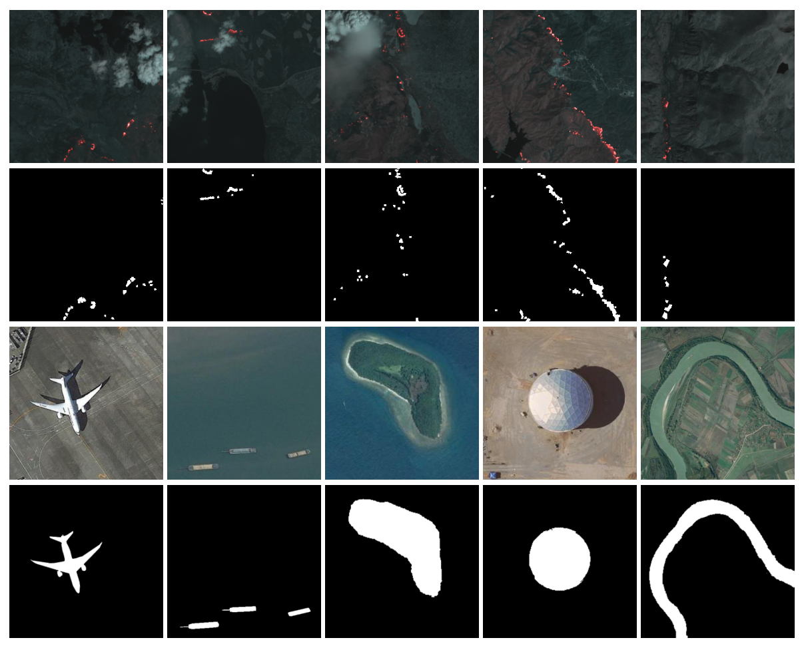
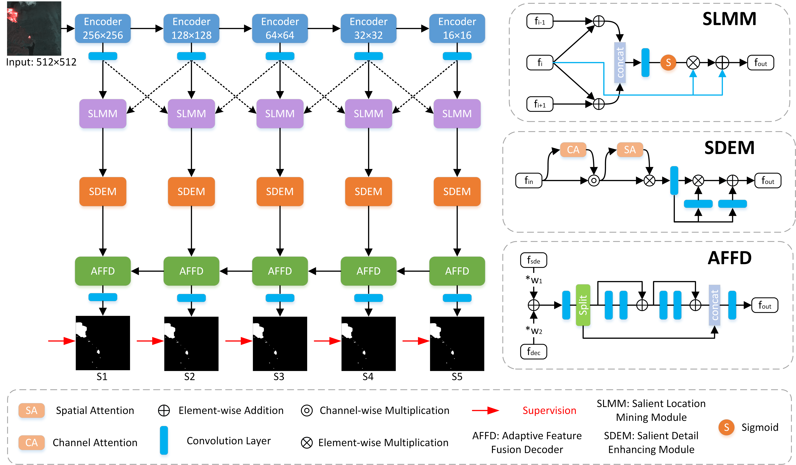

# LMDEN
<h2>This is the official repo for LMDEN, created by Voruarn, from School of Computer Science, Nanjing University of Information Science and Technology, Nanjing, China, 2023, November, 25th.</h2>

<h3>Merci!</h3>

<h3>Danke!</h3>

<h3>Xopomo!</h3>

<h2 style="text-align:center;">Some typical remote sensing images of forest fire and RSI-SOD.Odd rows are optical RSIs, while even rows are GT.</h2>

<h2 style="text-align:center;">Pipeline of the proposed LMDEN.</h2>

